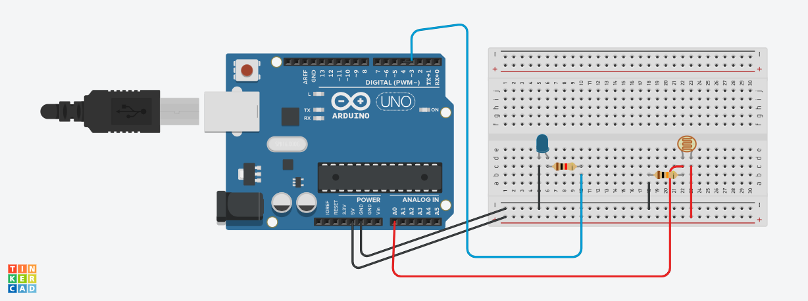

# Introduçao
fizemos um projeto em que o led liga dependendo a luminozidade do local

# Materias
- 1 placa arduino
- 1 fotoresistor
- 1 led
- 7 cabos macho e femea
- 2 reistor

#Codigo

//variaveis
int led =3;
int sensorluminosidade = A0;
// variavel para capturar a luminosidade
int luz = 0;

void setup()
{
  // led e de saida
 pinMode(led,OUTPUT);
  //sensor e de entrada
  pinMode(sensorluminosidade,INPUT);
}

void loop()
{
 // capturar o que o sensor leu no ambiente
 // analogRead e usado para leitura analogica
  luz = analogRead(sensorluminosidade);
  // as portas analogicas capturam dados que variam de 0 ate 1023
  
  if(luz<500){
    analogWrite(led,1023);
  } 
  if(luz>500 & luz<900){
  analogWrite(led,500);
  }
  else{
    digitalWrite(led,LOW);
  }
}
