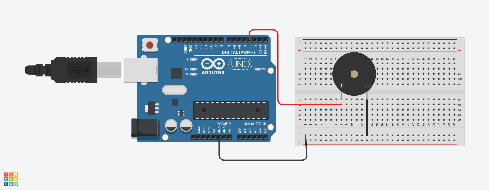

# Introduçao
fizemos um projeto em que utilizamos um componente chamado micro servo e conectamos ele no arduino e utilizamos o sensor de movimento para que  ele gire se ele chega perto de algo ele vira

# Materias
- 1 placa arduino
- 1 protobolt
- 11 cabo
- 1 micro servo
- 1 sensor de distancia
- 1 Led
- 1 resistor
  

#Codigo

#include <Servo.h>

int led = 2;
int servo = 7;
int posicao = 0;
Servo objetoservo;

// metedo para captura a distancia
// retorna um numero quebrado longo
long distancia (int trigger, int echo){
  // trigger porta de saida
  pinMode (trigger,OUTPUT);
  digitalWrite(trigger,LOW);
  delay(5);
  digitalWrite (trigger,HIGH);
  delay(10);
  digitalWrite(trigger,LOW);
  //echo porta de entrada
  pinMode(echo,INPUT);
  
  return pulseIn(echo,HIGH);
}
  
void setup()
  
{
  objetoservo.attach(servo);
  objetoservo.write(0);
  pinMode(led,OUTPUT);
}

void loop()
{
  //transforma o valor recebido para cm
  int cm =0.01723* distancia (4,4);
  
  if(cm<12) {// se menor que 1 metro/100cm
   
  digitalWrite(led,HIGH);
  
  objetoservo.write(posicao);
    posicao++;
    delay(100);  
  }
  if(cm>12) {
   
  digitalWrite(led,LOW);
  
  objetoservo.write(posicao);
   
    delay(100);  }
}
