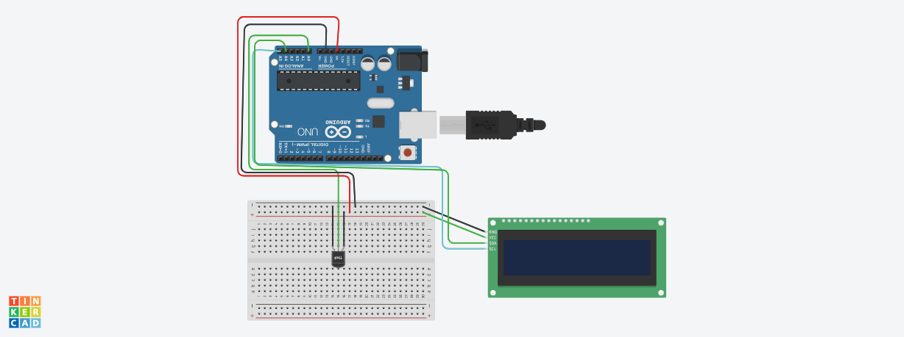

# Introduçao
nesse projeto fizemos um medidor de temperatura de ambiente onde pega a temperatura do local em grau celsius atravez de uma tela lcd

# Materias 
-1 placa arduino
-1 sensor de temperatura tmp
-1 tela LCD
-9 cabos macho femea

# Codigo

// BIBLIOTE LCD COM MODULO I2C
#include <LiquidCrystal_I2C.h>
// INICIALIZAR LCD
LiquidCrystal_I2C telaLcd(0x20,16,2);

// variavel do sensor de temperatura
int sensorTMP=A0;
// variavel para captura a temperatura
int valorlido = 0;

void setup()
{
// definir o sensor como entrada
  pinMode(sensorTMP,INPUT);
// ligar a tela lcd
  telaLcd.init();
  //limpar  os dados que aparecem
  telaLcd.clear();
  //aumenta a luminosidade do lcd
  telaLcd.backlight();
}

void loop()
{
 //capturar o valor da temperatura 
valorlido = analogRead(sensorTMP);
  //converter o valor da tensao
float tensao = (valorlido*5.0)/1024;
  // converter a tensao em graus celsius
  float temperatura = (tensao-0.5)*100;
  //imprimir valor da temperatura no lcd
  telaLcd.setCursor(0,0);
  telaLcd.print(temperatura);

}

