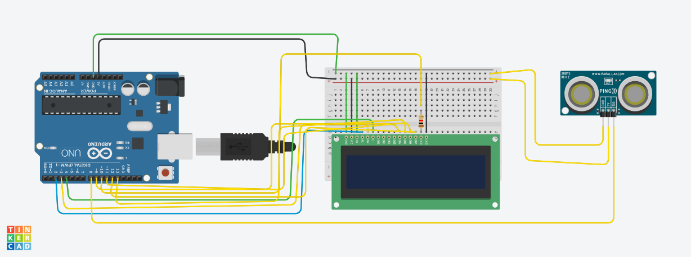

# Projeto de Tela lcd com sensor de Distancia

este projeto foi desnvolvido dentro do Tinkercad, na disciplina de internet das coisas (IOT), para a criaçao de um prototipo com arduino que simule uma mensagem de mantenha distancia toda vez que alguem se aproxime a menos de 1 mentro do sensor.

## Componentes Usados
- 1 Arduino Uno
- 14 jumper cabo macho macho
- 3 jumpers macho femeia
- 1 placa de ensaio
- 1 sensor de distancia
- 1 tela LCD 16x2
- 1 Resistor de 1 KOhms

  ## Montagem do circuito
  

  ## Explicaçao do Codigo

  Importando a biblioteca do LCD.
  # incldue <LiquidCrystal.h>

biblioteca do LCD
#include <LiquidCrystal.h>

criar variavel do lcd
LiquidCrystal lcd (2,3,4,9,10,11,12);

int ledLcd = 13;

metedo para captura a distancia
retorna um numero quebrado longo

long distancia (int trigger, int echo){
trigger porta de saida
  pinMode (trigger,OUTPUT);
  digitalWrite(trigger,LOW);
  delay(5);
  digitalWrite (trigger,HIGH);
  delay(10);
  digitalWrite(trigger,LOW);
  
  echo porta de entrada
  pinMode(echo,INPUT);
  
  return pulseIn(echo,HIGH);
  
}
void setup()
{
 pinMode(ledLcd,OUTPUT); DEFINIR LEDLCDSAIDA
 digitalWrite(ledLcd, HIGH);  ligar os LEDs do LCD
  lcd.begin(16,2);  informar que o lcd tem 16 colunas e 2 linhas
  lcd.clear();  iniciar o lcd limpo
}

void loop()
{
  transforma o valor recebido para cm
  int cm =0.01723* distancia (8,8);
  
  if(cm<100) { se menor que 1 metro/100cm
    lcd.setCursor(0,0);
    lcd.print("MANTENHA");
    lcd.setCursor(0,1);
    lcd.print("distancia");
  }
  	
}
